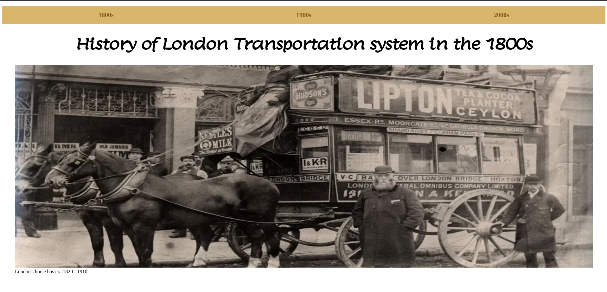
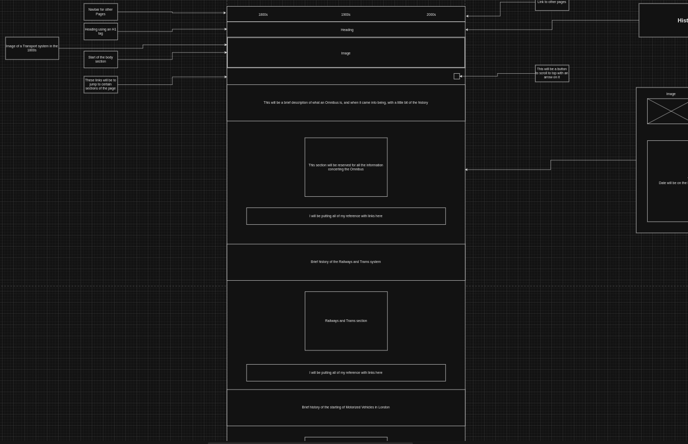
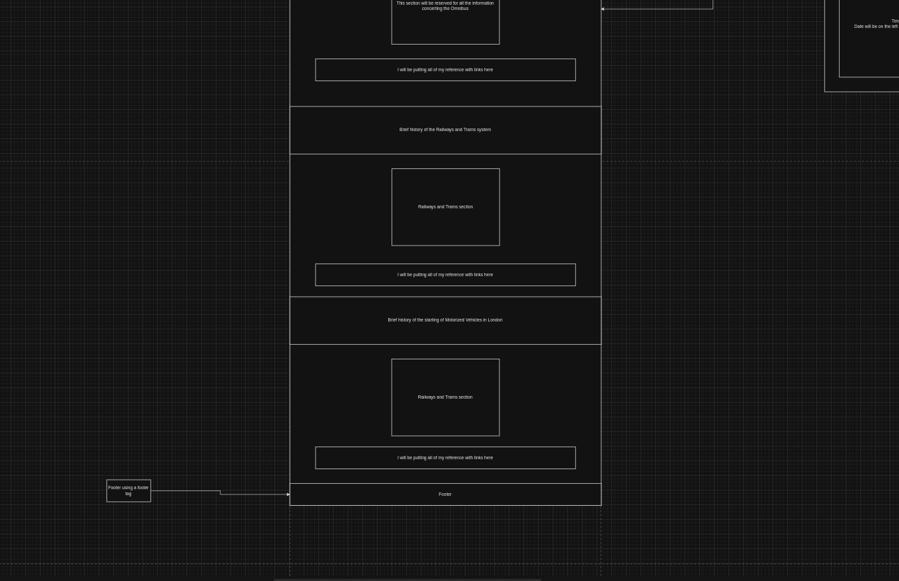
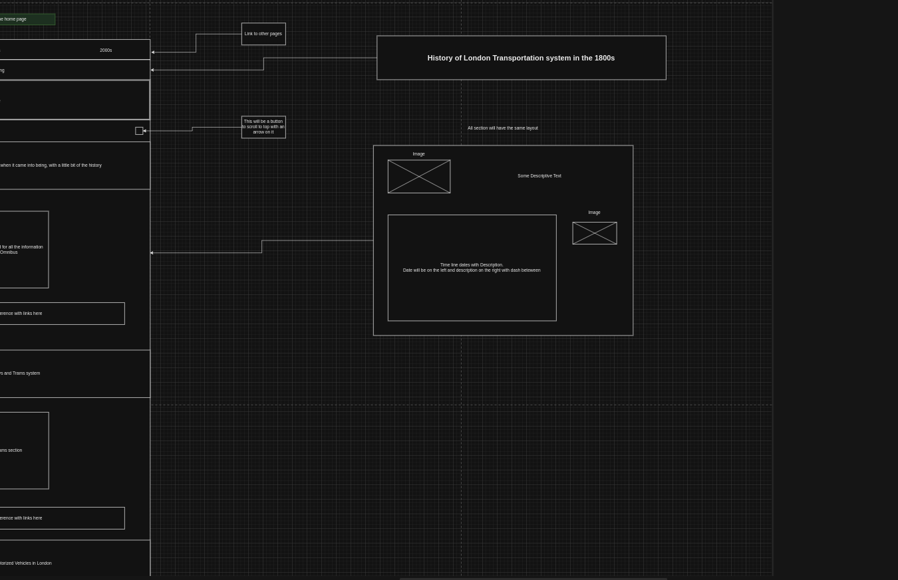
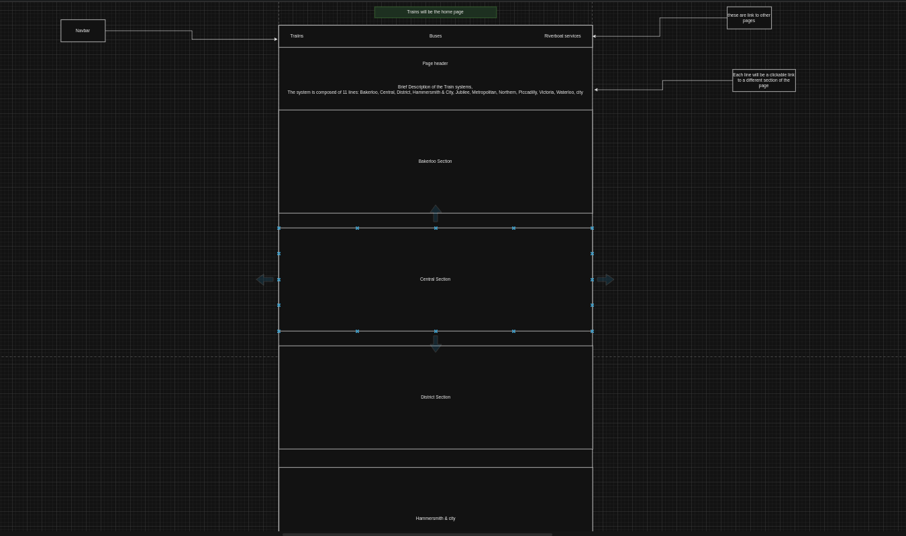
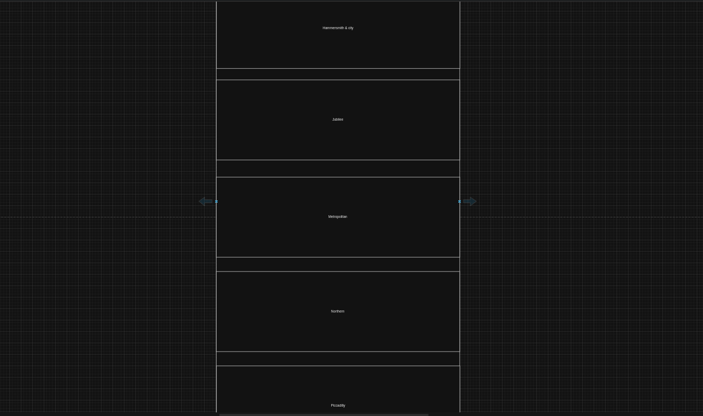
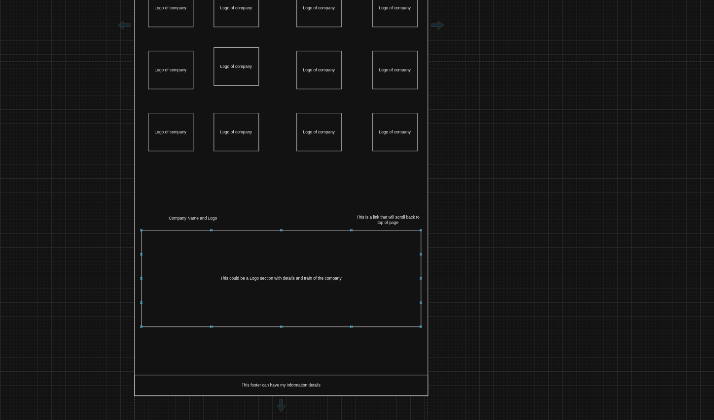
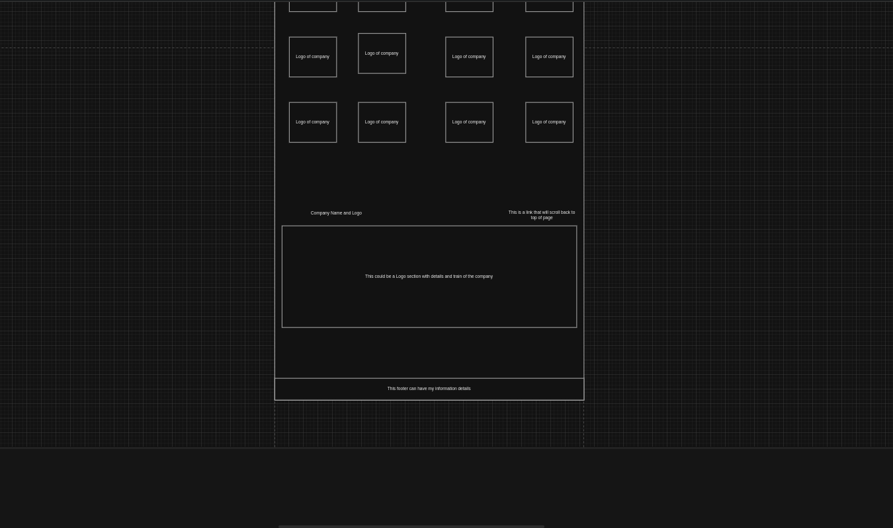

<h1>Project 1: HTML & CSS</h1>

<h2 id="table">Table of Content</h2>

<ul>
    <li><a href="#how">How this Document works?</a></li>
    <li><a href="#description">Description</a></li>
    <ul>
        <li><a href="#technology_used">Technologies that I used in this project</a></li>
        <li><a href="#screen_shots">Screen shots of website</a></li>
        <li><a href="#wireframes">Wireframe Diagrams</a></li>
    </ul>
    <li><a href="#install-project">How to install and run this Project</a></li>
    <li><a href="#use-project">How to use this project</a></li>
    <li><a href="#credits">Credits</a></li>
</ul>

<h2 id="how"><a href="#table">How this Document works?</a></h2>

<ul>
    <li>Above is the table of contents or the index page to point to the varies topics in this document</li>
    <li>Each Topic heading is a link that will direct you right back to the index page</li>
    <li>Right at the bottom of this page I have got a section for all my accreditation in this project</li>
</ul>

<h2 id="description"><a href="#table">Project Description</a></h2>

<h3 id="technology_used">Technologies that I used in this project</h3>

    <figure>
    
    <figcaption>HTML</figcaption>
</figure>

<figure>
    
    <figcaption>CSS</figcaption>
</figure>

<figure>
    
    <figcaption>GitHub</figcaption>
</figure>

<figure>
    
    <figcaption>Intellij</figcaption>
</figure>

<figure>
    
    <figcaption>VS code</figcaption>
</figure>

<h3 id="screen_shots">Screen shots of website</h3>

<h4>Header Section</h4>

<figure>
    
    <figcaption>This is the image of the home page with navbar on top</figcaption>
</figure>

<h3 id="wireframes">Wireframe Diagrams</h3>

<h4>Wireframe diagram that I am current using</h4>

<figure>
    <figcaption>Wireframe of top of drawing</figcaption>
    
</figure>

<figure>
    <figcaption>Wireframe of bottom of drawing</figcaption>
    
</figure>

<figure>
    <figcaption>What I am wanting the subsections to look like</figcaption>
    
</figure>

<h4>Old Wireframe Diagrams that I decided not to use</h4>

<figure>
    <figcaption>Top of second design</figcaption>
    <figcaption>I decided not to take this drawing as it became to lengthy and complicated</figcaption>
    
</figure>

<figure>
    <figcaption>Bottom of second design</figcaption>
    
</figure>

<figure>
    <figcaption>Top of third design</figcaption>
    <figcaption>I decided not to do it on the different companies as there is to many companies to choose from in London</figcaption>
    
</figure>

<figure>
    <figcaption>Bottom of third design</figcaption>
    
</figure>

<h2 id="install-project"><a href="#table">How to install and run this Project</a></h2>

<h2 id="use-project"><a href="#table">How to use this project</a></h2>

<h2 id="credits"><a href="#table">Credits</a></h2>

<ul>
    <li><a href="https://www.linkedin.com/in/lukebuchanan67/" style="text-decoration: none; color: aqua" target="_blank">Luke Buchanan - Mentor</a></li>
    <li><a href="https://codeinstitute.net/" style="text-decoration: none; color: aqua" target="_blank">Code Institute - Bootcamp</a></li>
</ul>

Welcome,

This is the Code Institute student template for Codeanywhere. We have preinstalled all of the tools you need to get started. It's perfectly ok to use this template as the basis for your project submissions.

You can safely delete this README.md file, or change it for your own project. Please do read it at least once, though! It contains some important information about Codeanywhere and the extensions we use. Some of this information has been updated since the video content was created. The last update to this file was: **May 11th, 2023**

## Codeanywhere Reminders

To run a frontend (HTML, CSS, Javascript only) application in Codeanywhere, in the terminal, type:

`python3 -m http.server`

A button should appear to click: _Open Preview_ or _Open Browser_.

To run a frontend (HTML, CSS, Javascript only) application in Codeanywhere with no-cache, you can use this alias for `python3 -m http.server`.

`http_server`

To run a backend Python file, type `python3 app.py`, if your Python file is named `app.py` of course.

A button should appear to click: _Open Preview_ or _Open Browser_.

In Codeanywhere you have superuser security privileges by default. Therefore you do not need to use the `sudo` (superuser do) command in the bash terminal in any of the lessons.

To log into the Heroku toolbelt CLI:

1. Log in to your Heroku account and go to _Account Settings_ in the menu under your avatar.
2. Scroll down to the _API Key_ and click _Reveal_
3. Copy the key
4. In Codeanywhere, from the terminal, run `heroku_config`
5. Paste in your API key when asked

You can now use the `heroku` CLI program - try running `heroku apps` to confirm it works. This API key is unique and private to you so do not share it. If you accidentally make it public then you can create a new one with _Regenerate API Key_.

---

Happy coding!
